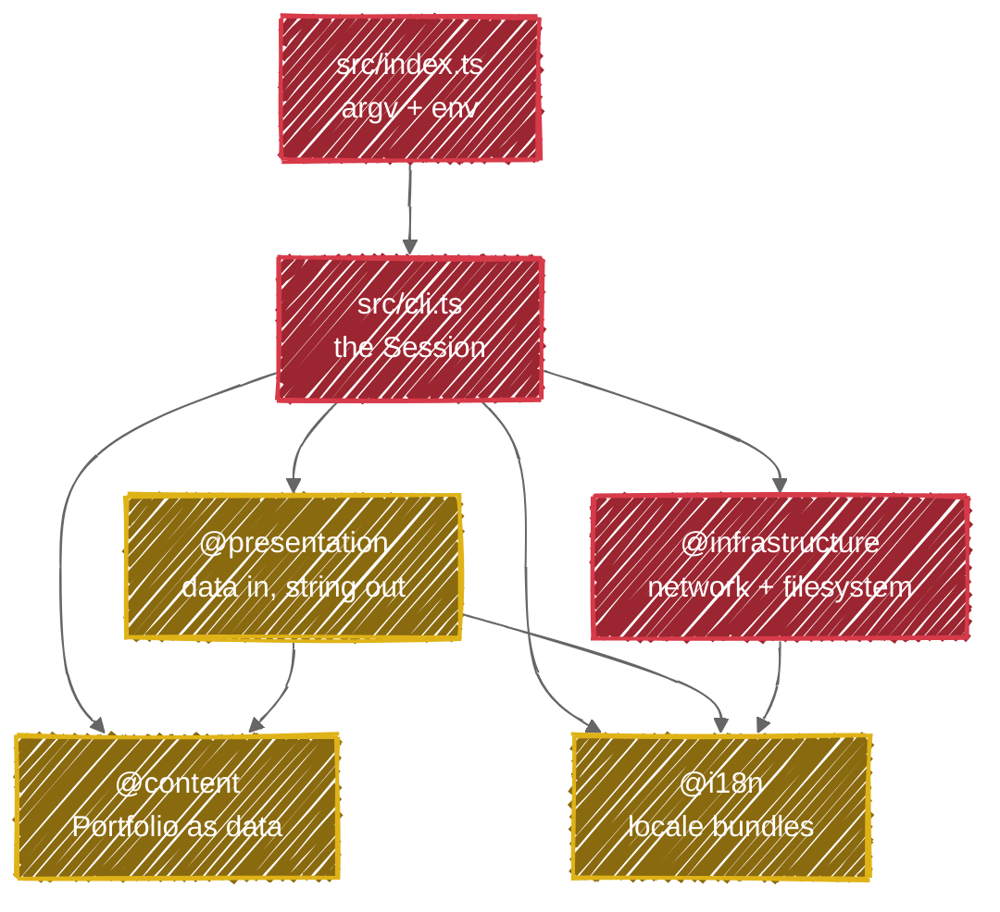

# Architecture

How this CLI is put together, for contributors. The domain vocabulary (Visitor, Session, Section, CV
Edition, Fallback) is [CONTEXT.md](./CONTEXT.md) and is not restated here; the conventions an agent or a
contributor works under are [CLAUDE.md](./CLAUDE.md); *why* each shape was chosen is [docs/adr/](./docs/adr/).

> **Status.** The decisions below were settled in a design session on 2026-07-30, before the TypeScript
> rewrite. `src/` does not exist yet: §1 and §2 describe the shape the code is being written **to**, not a
> tree you can currently open. Everything outside `src/` (tooling, CI, release) is real and in place.
> §5 lists what is still outstanding.

## 1. Layer map

The shape is a **functional core with an imperative shell**, in four folders rather than the seven a
full Domain-Driven Design(ish) layering would use. [ADR 0001](./docs/adr/0001-a-pure-core-and-an-imperative-shell-in-four-folders.md)
records why the smaller tree, and what is being traded for it.

**Gold is the pure core**: no `node:*`, no `fetch`, no prompts, no clock. **Red is the shell**, and
`@infrastructure` is the only place in the codebase that may reach the network or the filesystem.

| Folder | Alias | Responsibility | May import | Must not import |
| --- | --- | --- | --- | --- |
| `src/index.ts` | – | Reads `argv` and the environment, resolves the Locale, starts the Session, never rejects | `cli.ts`, `@i18n` | `@infrastructure` directly |
| `src/cli.ts` | – | Sequences the Session: which Section follows which, and what a Visitor's choice does | everything | – (it is the top) |
| content | `@content/*` | The Portfolio as typed data: Profile, Roles, Contacts | `@i18n` types only | everything else |
| i18n | `@i18n` | Locale bundles, lookup, fallback resolution | nothing (true leaf) | everything |
| presentation | `@presentation/*` | Pure rendering: data in, string out | `@content`, `@i18n` | `@infrastructure`, `node:*`, anything async |
| infrastructure | `@infrastructure/*` | Every side effect: retrieving a CV Edition, resolving the Downloads Folder, writing the file | `@i18n`, `node:*` | `@content`, `@presentation` |

Two rules govern the diagram, and they are the whole point of it: **`content`, `i18n` and `presentation`
are pure**, and **anything reaching for `node:fs`, `node:os` or `fetch` outside `infrastructure/` is a
defect**, however convenient. Resolving the Downloads Folder is I/O, not logic.

## 2. A Session, end to end

| # | Step | Layer | Notes |
| --- | --- | --- | --- |
| 1 | Parse `--lang`, read `LANG`/`LC_ALL` | entry | An unknown or unsupported value falls back to English rather than failing; see [ADR 0004](./docs/adr/0004-the-locale-selects-the-cv-edition.md) |
| 2 | Render the Section menu | presentation | Pure; the prompt itself is the shell's business |
| 3 | Visitor picks a Section | cli | Profile, Roles, CV, Contact. Every Section returns to the menu |
| 4 | Profile / Roles / Contact | presentation ← content | No network, no disk. These work offline, always |
| 5 | CV → request the edition for the Locale | infrastructure | From the CV Source; a 404 means that edition is not published |
| 6 | CV → Fallback to the English edition | infrastructure | Expected, not an error. The Visitor is told which language they got |
| 7 | CV → verify the bytes are a PDF | infrastructure | A successful fetch is not the same as receiving the document; see [ADR 0002](./docs/adr/0002-the-portfolio-ships-with-the-package-the-cv-does-not.md) |
| 8 | CV → write into the Downloads Folder | infrastructure | `os.homedir()`, creating the directory if absent |
| 9 | Exit | cli | The only thing that outlives the Session is a downloaded file |

Failure policy: a failed Download is reported and returns to the menu. It never ends the Session: every
other Section is still perfectly readable without a network.

## 3. Build & release

- **Bundling.** [`esbuild.config.ts`](./esbuild.config.ts) (run via `tsx`) bundles `src/index.ts` into a single `dist/index.js`,
  `platform: node`, `target: node20`, `format: esm`, with a `#!/usr/bin/env node` banner and source maps.
  Runtime dependencies are inlined, which is why `@inquirer/prompts`, `chalk` and `ora` are
  `devDependencies`: at publish time that is what they are. `dist/` is **not committed**; CI builds it
  immediately before publishing. [ADR 0003](./docs/adr/0003-dependencies-are-bundled-and-dist-is-not-committed.md).
- **Scripts.** `lint` = `biome check`; `typecheck` = `tsc --noEmit`; `test` / `test:coverage` = Vitest
  (v8 coverage, 85% threshold); `check` = lint + typecheck + coverage; `validate` = check + build.
  `pnpm verify` is what CI, the release job and the pre-push hook all run.
- **Biome** is linter and formatter both: 100 columns, 2-space, LF, single quotes, semicolons, trailing
  commas. [`.gitattributes`](./.gitattributes) pins `* text=auto eol=lf`.
- **Git hooks.** Husky: `pre-commit` → lint-staged (`biome check --write`), `commit-msg` → commitlint
  (conventional commits, since the version number depends on them), `pre-push` → typecheck + changed tests + build.
- **Release.** [`.releaserc.json`](./.releaserc.json): semantic-release on `main`, with commit-analyzer, release-notes-generator,
  changelog, npm (publishes to npmjs with provenance), exec (publishes the same version to GitHub
  Packages), git (commits [`package.json`](./package.json), [`pnpm-lock.yaml`](./pnpm-lock.yaml), `CHANGELOG.md`, never `dist/`) and github.
  There is no manual publish path. [ADR 0005](./docs/adr/0005-semantic-release-replaces-the-manual-publish-dispatch.md).

| Workflow | Purpose |
| --- | --- |
| [`ci.yml`](./.github/workflows/ci.yml) | One `Check` job running `pnpm verify` (format check, typecheck, coverage and build) on every push and PR to `main` |
| [`release.yml`](./.github/workflows/release.yml) | semantic-release on `main`: `pnpm verify`, then publish to npm and GitHub Packages |
| [`zizmor.yml`](./.github/workflows/zizmor.yml) | Static analysis of the workflows themselves |
| [`dependency-review.yml`](./.github/workflows/dependency-review.yml) | Fails a PR that introduces a dependency with a known vulnerability |
| [`commit-message.yml`](./.github/workflows/commit-message.yml) | Runs commitlint on the **pull request title**. `main` takes squash merges and the repository is set to `PR_TITLE`, so that title, not the branch's commits, is the message that lands and the one semantic-release reads. The `commit-msg` hook validates commits the squash then discards, so this is the only guard on the string that ships |
| [`renovate-auto-approve.yml`](./.github/workflows/renovate-auto-approve.yml), [`dependabot-auto-merge.yml`](./.github/workflows/dependabot-auto-merge.yml) | Dependency update automation |

`pnpm` is the package manager everywhere: `packageManager` pins it, `pnpm-lock.yaml` is the only
lockfile, and [`pnpm-workspace.yaml`](./pnpm-workspace.yaml) holds a three-day `minimumReleaseAge` on new dependency versions.

## 4. Where things live

Three axes, three documents. [CONTEXT.md](./CONTEXT.md) is what the words **mean**. This file is
**structure**. [docs/adr/](./docs/adr/) is **why**:

| ADR | Decision |
| --- | --- |
| [0001](./docs/adr/0001-a-pure-core-and-an-imperative-shell-in-four-folders.md) | A pure core and an imperative shell, in four folders |
| [0002](./docs/adr/0002-the-portfolio-ships-with-the-package-the-cv-does-not.md) | The Portfolio ships with the package, the CV does not |
| [0003](./docs/adr/0003-dependencies-are-bundled-and-dist-is-not-committed.md) | Dependencies are bundled, and `dist/` is not committed |
| [0004](./docs/adr/0004-the-locale-selects-the-cv-edition.md) | The Locale selects the CV Edition, with an English fallback |
| [0005](./docs/adr/0005-semantic-release-replaces-the-manual-publish-dispatch.md) | semantic-release replaces the manual publish dispatch |

Every one of them follows [0000, the template](./docs/adr/0000-adr-template.md): `# N. Title`, a date, a
status, then *Context*, *Decision*, *Consequences*. A new ADR starts by copying that file, and adds its row
to the table above; an ADR nothing links to will not be read.

## 5. Known inconsistencies

Record each with the evidence that proves it, and delete the entry when the code changes; an entry that
has quietly become false is worse than no list at all.

- **`src/` does not exist.** The v1 `index.js` was deleted and the TypeScript rewrite has not landed. §1 and
  §2 are therefore a specification, not a description. Lint, typecheck and coverage already pass on the
  empty tree; only `build` cannot run without an entry point, so a `hashFiles('src/**/*.ts')` guard skips it
  in `ci.yml`, skips the build and publish steps in `release.yml` (publishing without `dist/` would ship a
  package whose `bin` does not exist), and a matching `[ ! -d src ]` guard sits in `.husky/pre-push`. All
  three become permanently true when sources land, and should be deleted then rather than left to rot.
  (`hashFiles` only works in a step-level `if`: at job level it is evaluated before checkout and the
  workflow fails to start.)
- **The Portfolio has no content.** The v1 printed `'Hobbies and interests: TODO'` and three siblings of it.
  Whatever replaces them has to exist in English, Spanish and Catalan from the first commit; see
  [ADR 0004](./docs/adr/0004-the-locale-selects-the-cv-edition.md).
- **Only one CV Edition is published.** `fbuireu/fbuireu` serves exactly `assets/pdf/Ferran-Buireu-CV.pdf`,
  so every non-English Visitor currently takes the Fallback path. That path is the common case today, not
  the edge case, and should be tested as such.
